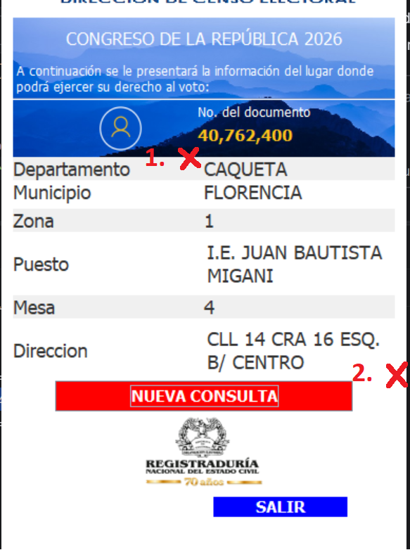

# InfoVotación Auto - Automated Voting Information Extraction

## Overview
**InfoVotación Auto** is an automated tool that extracts voting location information from the InfoVotantes system using OCR (Optical Character Recognition). It processes multiple cedula numbers from an Excel file and automatically populates voting information including Departamento, Municipio, Zona, Puesto, Mesa, and Dirección.

---

## 📋 System Requirements

### Minimum Requirements:
- **Operating System**: Windows 7 or later (Windows 10/11 recommended)
- **RAM**: 4GB minimum
- **Disk Space**: 500MB free space
- **Screen Resolution**: 1280x720 or higher

### Required Software:
1. **Tesseract OCR** (see installation instructions below)
2. **InfoVotantes Desktop Application** installed at `C:\InfoVotantes\InfoVotantes.exe`

---

## 🔧 Installation

### Step 1: Install Tesseract OCR

Tesseract OCR is **REQUIRED** for text extraction. Follow these steps carefully:

#### 1.1 Download Tesseract
1. Visit: https://github.com/UB-Mannheim/tesseract/wiki
2. Download the latest Windows installer (e.g., `tesseract-ocr-w64-setup-v5.x.x.exe`)
3. Save to your Downloads folder

#### 1.2 Install Tesseract
1. Run the downloaded `.exe` installer
2. **IMPORTANT**: Install to the default location: `C:\Program Files\Tesseract-OCR`
3. During installation, make sure to check **"Add to PATH"** option if available
4. Complete the installation

#### 1.3 Add Tesseract to System PATH (If not automatically added)

**Windows 10/11:**
1. Press `Win + X` and select **System**
2. Click **Advanced system settings**
3. Click **Environment Variables**
4. Under **System variables**, find and select **Path**, then click **Edit**
5. Click **New** and add: `C:\Program Files\Tesseract-OCR`
6. Click **OK** on all windows
7. **Restart your computer** for changes to take effect

#### 1.4 Verify Tesseract Installation
1. Open **Command Prompt** (Win + R, type `cmd`, press Enter)
2. Type: `tesseract --version`
3. You should see output like:
   ```
   tesseract v5.x.x
   ```
4. If you see an error, Tesseract is not properly installed or not in PATH

---

### Step 2: Prepare InfoVotantes Application

Ensure the InfoVotantes desktop application is installed at:
```
C:\InfoVotantes\InfoVotantes.exe
```

If it's installed in a different location, you'll need to move it or update the configuration.

---

### Step 3: Set Up the Automation Tool

1. **Copy the `main.exe` file** to any folder on your computer (e.g., `C:\InfoVotacionAuto\`)
2. **Create or copy `InfoVotantes.xlsx`** to the **same folder** as `main.exe`

**Folder structure should look like:**
```
C:\InfoVotacionAuto\
├── main.exe                    ← The automation executable
├── getwindow.py                ← (Optional) Screen configuration tool
└── InfoVotantes.xlsx           ← Your Excel file with cedulas
```

---

### Step 3.5: Configure Screen Coordinates (First Time Setup Per Computer)

**⚠️ IMPORTANT**: Each computer with different screen resolution or DPI settings needs to configure the OCR capture region.

**If the application doesn't read anything or reads incorrectly:**

#### Configuration Process:

1. **Launch InfoVotantes Application**
   - Open the InfoVotantes desktop application normally
   - Search for a cedula number to display the voting information results

2. **Start Configuration Tool**
   - Run `config.exe` from the same folder as `main.exe`
   - A configuration window will appear in the background

3. **Configure Position 1 (Top-Left Corner)**
   - Look at the InfoVotantes application showing the voting information results
   - Move your mouse to the **TOP-LEFT corner** of the result information area (see screenshot below)
   - Press **Alt + Tab** to bring the configuration window to the front
   - Press **Enter** to confirm the first position
   - The configuration window will minimize/go to background

4. **Configure Position 2 (Bottom-Right Corner)**
   - Press **Alt + Tab** again to return to the InfoVotantes application
   - Move your mouse to the **BOTTOM-RIGHT corner** of the result information area
   - Press **Alt + Tab** to bring the configuration window to the front again
   - Press **Enter** to confirm the second position

5. **Configuration Saved!**
   - A `config.ini` file will be created with the correct coordinates for this computer
   - The configuration window will close

6. **Run `main.exe`** again - it will now use the configured coordinates

---

**Note**: This configuration is saved per-computer and only needs to be done once (unless screen resolution or DPI settings change).

<details>
<summary>📸 <b>Click here to view the Configuration Screenshot</b></summary>



</details>

---

## 📊 Prepare Your Excel File

### Excel File Format:
- **File Name**: Must be named `InfoVotantes.xlsx`
- **Location**: Same folder as `main.exe`
- **Format**: 
  - Column A (starting row 2): Cedula numbers
  - Columns B-G: Will be automatically populated with results

### Example Excel Structure:

| A (Cedula)   | B (Departamento) | C (Municipio) | D (Zona) | E (Puesto) | F (Mesa) | G (Dirección) |
|--------------|------------------|---------------|----------|------------|----------|---------------|
| **Cedula**   | Departamento     | Municipio     | Zona     | Puesto     | Mesa     | Dirección     |
| 1117512408   | *(auto-filled)*  | *(auto)*      | *(auto)* | *(auto)*   | *(auto)* | *(auto)*      |
| 1234567890   | *(auto-filled)*  | *(auto)*      | *(auto)* | *(auto)*   | *(auto)* | *(auto)*      |
| ...          | ...              | ...           | ...      | ...        | ...      | ...           |

**Important Notes:**
- Row 1 is for headers (optional but recommended)
- Cedulas start from row 2 in column A
- Leave columns B-G empty - they will be filled automatically
- The script stops when it encounters an empty cell in column A

---

## 🚀 How to Use

### Step-by-Step Instructions:

1. **Ensure Tesseract is installed and in PATH** (see installation steps above)

2. **Ensure InfoVotantes.exe is installed** at `C:\InfoVotantes\InfoVotantes.exe`

3. **Prepare your Excel file** with cedula numbers in column A

4. **Place the Excel file** in the same folder as `main.exe`

5. **Double-click `main.exe`** to start the automation

6. **The automation will:**
   - Launch the InfoVotantes application
   - Read cedula numbers from the Excel file
   - For each cedula:
     - Enter the cedula number
     - Capture and extract voting information using OCR
     - Save results to columns B-G in the Excel file
     - Display progress in the console window

7. **Monitor the progress** in the console window:
   ```
   14:23:45 - INFO - Processing cedula 1 of 10: 1117512408
   14:23:55 - INFO - Result:
   Departamento: CAQUETA
   Municipio: FLORENCIA
   Zona: 4
   Puesto: I.E. CIUDADELA SIGLO XXI
   Mesa: 3
   Direccion: CL16C-13K KRS 2F-2H BR. ABAS TURBAY
   ```

8. **Wait for completion** - The script will process all cedulas automatically

9. **Check the results** in `InfoVotantes.xlsx` - columns B-G will be populated

10. **Review the log file** - A log file `infovotantes_YYYYMMDD_HHMMSS.log` is created in the same folder for audit purposes

---

## 📝 Log Files

Every run creates a timestamped log file in the same folder as the executable:
- **Format**: `infovotantes_20260226_142345.log`
- **Contains**: All operations, results, errors, and warnings
- **Use for**: Debugging, auditing, or reviewing past runs

---

## ⚠️ Troubleshooting

### Error: "Tesseract not found"
**Solution**: 
1. Verify Tesseract is installed at `C:\Program Files\Tesseract-OCR`
2. Check that Tesseract is added to system PATH
3. Restart your computer after adding to PATH
4. Run `tesseract --version` in Command Prompt to verify

### Error: "Excel file not found"
**Solution**:
1. Ensure `InfoVotantes.xlsx` is in the **same folder** as `main.exe`
2. Check the filename is exactly `InfoVotantes.xlsx` (case-sensitive)
3. Make sure the file is not open in Excel

### Error: "InfoVotantes.exe not found"
**Solution**:
1. Verify InfoVotantes is installed at `C:\InfoVotantes\InfoVotantes.exe`
2. If installed elsewhere, move it to `C:\InfoVotantes\`

### Poor OCR Results / Incorrect Data / Not Reading Anything
**Most common cause**: Screen region coordinates are incorrect for this computer.

**Solution**:
1. Run `config.exe` to configure the correct screen region for this computer
2. Follow the interactive process:
   - Position your mouse at the TOP-LEFT corner of the result area and use Alt+Tab to switch to config.exe, then press Enter
   - Switch back to InfoVotantes app and position at BOTTOM-RIGHT corner, then Alt+Tab to config.exe and press Enter
3. A `config.ini` file will be created with the correct coordinates
4. Run `main.exe` again

**Other possible causes**:
- Screen scaling settings - try 100% scaling in Windows display settings
- InfoVotantes application UI has changed - reconfigure using `config.exe`
- Different screen resolution than original setup computer

### Application Not Responding
**Solution**:
- Check that InfoVotantes application is not already running
- Close InfoVotantes manually and restart the automation
- Ensure no other applications are interfering with keyboard/mouse automation

### No Cedulas Found
**Solution**:
1. Check that cedulas start from row 2 in column A
2. Ensure cells contain cedula numbers (not formulas)
3. Make sure the file is saved in `.xlsx` format (not `.xls` or `.csv`)

---

## 🛡️ Important Notes

### **Do Not Interrupt the Automation**
- Once started, **do not use your mouse or keyboard**
- The automation controls the mouse and keyboard - interference will cause errors
- Let the process complete for all cedulas

### **Screen Requirements**
- Keep the InfoVotantes window visible and unobstructed
- Do not minimize or cover the window
- Do not change screen resolution during operation

### **Data Backup**
- Always keep a backup of your original Excel file
- Log files are created for each run - review them if issues occur

### **Performance**
- Processing time: ~10-15 seconds per cedula
- For 100 cedulas, expect ~20-30 minutes total runtime

---

## 📂 File Structure

After installation and first run, your folder should contain:

```
C:\InfoVotacionAuto\
├── main.exe                                    ← Automation executable
├── config.exe                                  ← Screen configuration tool
├── config.ini                                  ← Screen coordinates (auto-generated by config.exe)
├── InfoVotantes.xlsx                           ← Input/Output Excel file
├── infovotantes_20260226_142345.log          ← Log file (auto-generated)
└── infovotantes_20260226_153020.log          ← Another log (each run creates new)
```

**Files to deploy to new computers:**
- `main.exe` - Required (main application)
- `config.exe` - Required (for screen configuration on first run)
- `InfoVotantes.xlsx` - Required (your data file)

**Files auto-generated (don't need to copy):**
- `config.ini` - Created by config.exe on each computer
- `*.log` - Log files from each run

---

## 🔄 Updating

To update to a new version:
1. Close any running instances of `main.exe`
2. Replace the old `main.exe` with the new version
3. Keep your existing `InfoVotantes.xlsx` file
4. Old log files can be deleted or archived

---

## 📞 Support

If you encounter issues:
1. Review the troubleshooting section above
2. Check the log file for detailed error messages
3. Verify all installation steps were completed correctly
4. Ensure Tesseract is properly installed and in PATH

---

## 📄 Technical Details

### Technology Stack:
- **Python** (bundled in executable)
- **Tesseract OCR** (external dependency)
- **PyAutoGUI** - GUI automation
- **OpenPyxl** - Excel file handling
- **Pytesseract** - OCR wrapper

### OCR Processing:
- Captures a specific screen region where voting info is displayed
- Applies image preprocessing for better accuracy
- Parses structured data from OCR text
- Post-processes to fix common OCR errors (e.g., `0` vs `O`, digit cleanup)

---

## ⚖️ License & Disclaimer

This tool is provided as-is for electoral voting information retrieval automation. Use responsibly and in accordance with applicable regulations.

---

## 📌 Quick Start Checklist

- [ ] Tesseract OCR installed at `C:\Program Files\Tesseract-OCR`
- [ ] Tesseract added to system PATH
- [ ] Verified Tesseract with `tesseract --version` command
- [ ] InfoVotantes.exe installed at `C:\InfoVotantes\InfoVotantes.exe`
- [ ] `main.exe` copied to desired folder
- [ ] `InfoVotantes.xlsx` created with cedulas in column A (starting row 2)
- [ ] Excel file placed in same folder as `main.exe`
- [ ] Computer restarted after Tesseract installation (if PATH was modified)

✅ Ready to run!

---

**Version**: 1.0  
**Last Updated**: February 2026
